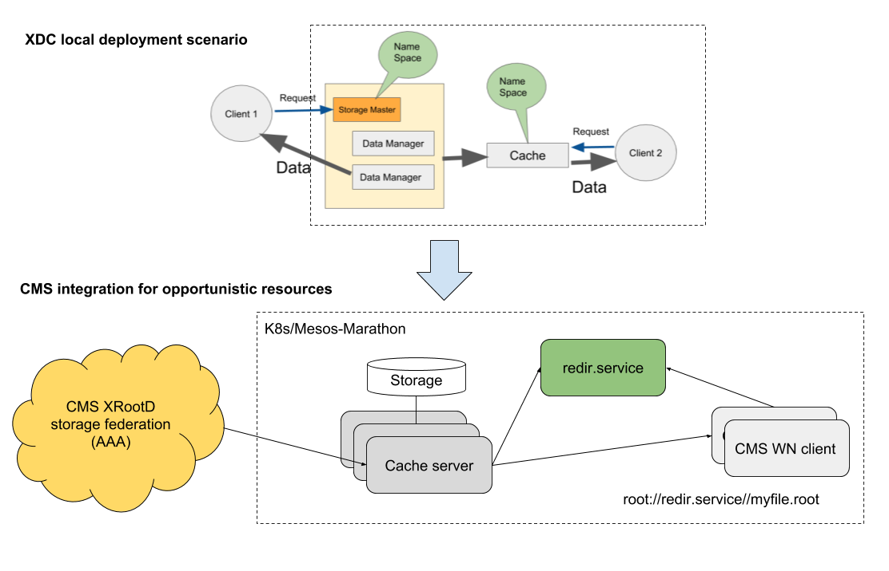
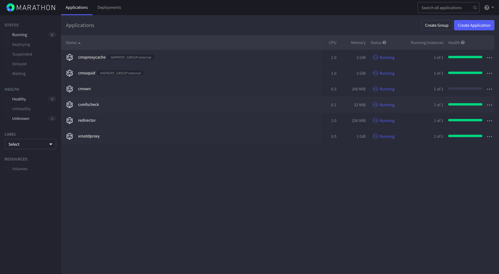

# XDC HA Meeting: XCache Demo

## Automated deployment on dynamic resources

### Objectives

Demostrate an automatic deployment of a XCache cluster on cloud providers to be used for opportunistic computing resource. The context in which thi solution is being tested is  the CMS experiment.

### What is going to be deployed

The following example will deploy one XCache server per VM + a unique XCache federator and an instance running a plain server from where the xrdcp commands can be tested.
You can find below the yaml configuration files for the complete deployment on K8s and, at the bottom, a summary of what is going to be demo-ed (other than deployment).

### Setup schema



## XCache local deployment for opportunistic cloud resources

The demo will make use of K8s, allowing to run the whole deployment step by step in a simpler way.

- K8s pre-installed resources:
  - [TSystem](https://160.44.198.123:30443/#!/login)
  - [cloud@CNAF](https://131.154.96.89:30443/#!/login)

N.B. the whole set of intermediate step are executed manually just as demostrator. TOSCA templates for [K8s](https://raw.githubusercontent.com/Cloud-PG/XDC-HA-demo/master/templates/DODAS-TS/kube_deploy.yml) and [Mesos/Marathon](https://raw.githubusercontent.com/Cloud-PG/XDC-HA-demo/master/templates/DODAS-TS/cms_cluster.yml) end to end deployment are available for real case scenario.

### Deploy K8d XCache service

[xcache_service.yaml](https://raw.githubusercontent.com/Cloud-PG/XDC-HA-demo/master/templates/k8s/xcache_service.yaml)

``` yaml
kind: Service
apiVersion: v1
metadata:
  name: xcache-service
spec:
  type: NodePort
  selector:
    app: xredir
  ports:
  - protocol: TCP
    name: xrootd
    port: 1094
    targetPort: 1094
    nodePort: 31094
  - protocol: TCP
    name: cmsd
    port: 31213
    targetPort: 31213
    nodePort: 31213

```

### Deploy XCache redirector

[redir-deployment.yaml](https://raw.githubusercontent.com/Cloud-PG/XDC-HA-demo/master/templates/k8s/redir-deployment.yaml)

``` yaml
apiVersion: apps/v1
kind: Deployment
metadata:
  name: xredir-pod
  labels:
    app: xredir
spec:
  template:
    metadata:
      labels:
        app: xredir
    spec:
      containers:
      - name: redirector
        imagePullPolicy: Always
        args:
        - --nogrid
        - --redirector
        - --health_port
        - "8080"
        env:
        - name: REDIR_CMSD_PORT
          value: "31213"
        - name: REDIR_HOST
          value: xcache-service.default.svc.cluster.local
        - name: REDIR_XRD_PORT
          value: "1094"
        image: cloudpg/xrootd-proxy:xcache
        livenessProbe:
          exec:
            command:
            - curl
            - -f
            - http://localhost:8080/check_health
        ports:
        - containerPort: 1094
        - containerPort: 31213

  selector:
    matchLabels:
      app: xredir

  replicas: 1
```

### Deploy XCache servers

[cache-deployment.yaml](https://raw.githubusercontent.com/Cloud-PG/XDC-HA-demo/master/templates/k8s/cache-deployment.yaml)

``` yaml
---
apiVersion: apps/v1
kind: Deployment
metadata:
  name: xcache-pod
  labels:
    app: xcache
spec:
  template:
    metadata:
      labels:
        app: xcache
    spec:
      imagePullPolicy: Always
      affinity:
        podAntiAffinity:
          requiredDuringSchedulingIgnoredDuringExecution:
          - labelSelector:
              matchExpressions:
              - key: app
                operator: In
                values:
                - xcache
            topologyKey: "kubernetes.io/hostname"
      containers:
      - name: cache
        imagePullPolicy: Always
        args:
        - --proxy
        - --health_port
        - "8088"
        env:
        - name: BLOCK_SIZE
          value: 512k
        - name: CACHE_LOG_LEVEL
          value: info
        - name: CACHE_PATH
          value: /data/xrd
        - name: CACHE_RAM_GB
          value: "2"
        - name: HI_WM
          value: "0.9"
        - name: LOW_WM
          value: "0.8"
        - name: N_PREFETCH
          value: "0"
        - name: ORIGIN_HOST
          value: xrootd-cms.infn.it
        - name: ORIGIN_XRD_PORT
          value: "1094"
        - name: REDIR_CMSD_PORT
          value: "31213"
        - name: REDIR_HOST
          value: xcache-service.default.svc.cluster.local
        - name: STREAMS
          value: "256"
        image: cloudpg/xrootd-proxy:demo
        livenessProbe:
          exec:
            command:
            - curl
            - -f
            - http://localhost:8088/check_health
          initialDelaySeconds: 300
          periodSeconds: 60
        ports:
        - containerPort: 32294
        - containerPort: 31113

  selector:
    matchLabels:
      app: xcache

  replicas: 3
  volumes:
  - name: xcache-data
    hostPath:
      path: /data/xrd

```

### Deploy a client node + fake origin server

[client_server-deployment.yaml](https://raw.githubusercontent.com/Cloud-PG/XDC-HA-demo/master/templates/k8s/client_server-deployment.yaml)

``` yaml
apiVersion: apps/v1
kind: Deployment
metadata:
  name: node-pod
  labels:
    app: origin
spec:
  template:
    metadata:
      labels:
        app: origin
    spec:
      containers:
      - name: clientAndServer
        imagePullPolicy: Always
        args:
        - --nogrid
        - --config
        - /etc/xrootd/xrd_test_origin.conf
        - --health_port
        - "8080"
        image: cloudpg/xrootd-proxy:xcache
        livenessProbe:
          exec:
            command:
            - curl
            - -f
            - http://localhost:8080/check_health
        ports:
        - containerPort: 1194

  selector:
    matchLabels:
      app: origin

  replicas: 1
```

### Demo tests

For time reason of the demo a pre-installed origin server will be used as remote data source. On that server has been put a file called `test.txt`

After the complete deployment, all the deployments should be green as in the figure below.

[](https://cloud-pg.github.io/XDC-HA-demo/img/k8s.png)

We are going to do the following:

- look briefly at redirector logs, to see XCache servers registering themselves
- from the client node request a copy of the `test.txt` to the XCache redirector
  - `xrdcp -f -d2 root://xcache-service.default.svc.cluster.local//store/mc/RunIIFall17DRPremix/DStarToD0Pi_D0KPi_DStarFilter_TuneCP5_13TeV-pythia8-evtgen/AODSIM/94X_mc2017_realistic_v10-v1/70000/FAC9CE9A-40EE-E711-AF02-E0071B7A8560.root /dev/null`
  - in few words at this point the redirector is going to check in any cache server has it on disk
    - if any, will make client contact that server directly
    - otherwise it will choose via round robin a cache server that will work as a proxy for the current client request, but caching data meanwhile
- check that the file is actually stored on the cache server that was contacted
- retry to make the same request from the client node and check that indeed it come from the same server that has the file on disk now
  - the transfer speed should look a bit better indeed
- scale up and down the cluster dynamically

Additional:

- [Mesos/Marathon equivalent with WN](http://90.147.75.180:8080/ui/#/apps)

[](https://cloud-pg.github.io/XDC-HA-demo/img/marathon.png)

- copy file from XCACHE@CNAF and look at the [monitor page](https://193.204.89.68:3000/d/gZht3p4iz/infn-xcache-monitor)

  - need voms proxy ready on a vm

[](https://cloud-pg.github.io/XDC-HA-demo/img/graphana.png)

