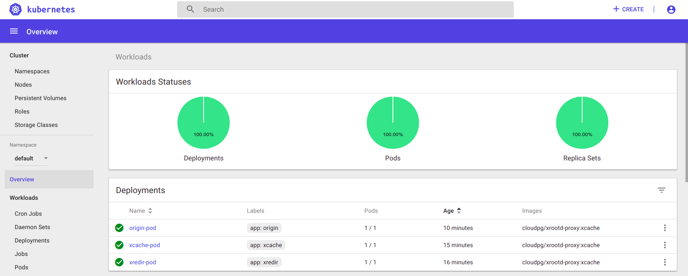
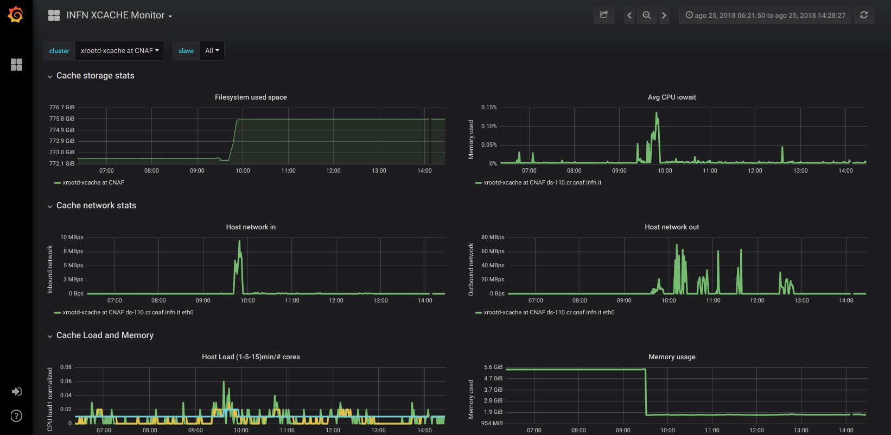

# XDC HA Meeting: XCache Demo

## Deploy K8s on any cloud with DODAS-TS

Although is not the only way, I put here the references and contacts for whoever is interested in deploy K8s on any cloud provider with a unique configuration file. The procedure uses PaaS Orchestrator for K8s deployment.

- [User Guide](https://dodas-ts.github.io/dodas-doc/)
- [K8s template](https://raw.githubusercontent.com/Cloud-PG/XDC-HA-demo/master/templates/DODAS-TS/kube_deploy.yml)
- [XCache CMS templates](https://github.com/Cloud-PG/docker-images/tree/xcache/xrd-proxy)


## XCache local deployment for cloud resources

- K8s pre-installed resources:
  - [TSystem](https://160.44.198.123:30443/#!/login)
  - [cloud@CNAF](https://131.154.96.89:30443/#!/login)

### What is going to be deployed?

The following example will deploy one XCache server per VM + a unique XCache federator and an instance running a plain server from where the xrdcp commands can be tested.
You can find below the yaml configuration files for the complete deployment on K8s and, at the bottom, a summary of what is going to be demo-ed (other than deployment).

### Deploy K8d XCache service

``` yaml
kind: Service
apiVersion: v1
metadata:
  name: xcache-service
spec:
  type: NodePort
  selector:
    app: xredir
  ports:
  - protocol: TCP
    name: xrootd
    port: 1094
    targetPort: 1094
    nodePort: 31094
  - protocol: TCP
    name: cmsd
    port: 31213
    targetPort: 31213
    nodePort: 31213

```

### Deploy XCache redirector

``` yaml
apiVersion: apps/v1
kind: Deployment
metadata:
  name: xredir-pod
  labels:
    app: xredir
spec:
  template:
    metadata:
      labels:
        app: xredir
    spec:
      containers:
      - name: redirector
        imagePullPolicy: Always
        args:
        - --nogrid
        - --redirector
        - --health_port
        - "8080"
        env:
        - name: REDIR_CMSD_PORT
          value: "31213"
        - name: REDIR_HOST
          value: xcache-service.default.svc.cluster.local 
        - name: REDIR_XRD_PORT
          value: "1094"
        image: cloudpg/xrootd-proxy:xcache
        livenessProbe:
          exec:
            command:
            - curl
            - -f
            - http://localhost:8080/check_health
        ports:
        - containerPort: 1094
        - containerPort: 31213

  selector:
    matchLabels:
      app: xredir

  replicas: 1
```

### Deploy XCache servers

``` yaml
apiVersion: apps/v1
kind: Deployment
metadata:
  name: xcache-pod
  labels:
    app: xcache
spec:
  template:
    metadata:
      labels:
        app: xcache
    spec:
      imagePullPolicy: Always
      affinity:
        podAntiAffinity:
          requiredDuringSchedulingIgnoredDuringExecution:
          - labelSelector:
              matchExpressions:
              - key: app
                operator: In
                values:
                - xcache
            topologyKey: "kubernetes.io/hostname"
      containers:
      - name: cache
        imagePullPolicy: Always
        args:
        - --nogrid
        - --proxy
        - --health_port
        - "8088"
        env:
        - name: BLOCK_SIZE
          value: 512k
        - name: CACHE_LOG_LEVEL
          value: info
        - name: CACHE_PATH
          value: /data/xrd
        - name: CACHE_RAM_GB
          value: "2"
        - name: HI_WM
          value: "0.9"
        - name: LOW_WM
          value: "0.8"
        - name: N_PREFETCH
          value: "0"
        - name: ORIGIN_HOST
          value: 80.158.5.211
        - name: ORIGIN_XRD_PORT
          value: "32294"
        - name: REDIR_CMSD_PORT
          value: "31213"
        - name: REDIR_HOST
          value: xcache-service.default.svc.cluster.local
        - name: STREAMS
          value: "256"
        image: cloudpg/xrootd-proxy:xcache
        livenessProbe:
          exec:
            command:
            - curl
            - -f
            - http://localhost:8088/check_health
        ports:
        - containerPort: 32294
        - containerPort: 31113

  selector:
    matchLabels:
      app: xcache

  replicas: 3
  volumes:
  - name: xcache-data
    hostPath:
      path: /data/xrd

```

### Deploy a client node + fake origin server

``` yaml
apiVersion: apps/v1
kind: Deployment
metadata:
  name: node-pod
  labels:
    app: origin
spec:
  template:
    metadata:
      labels:
        app: origin
    spec:
      containers:
      - name: clientAndServer
        imagePullPolicy: Always
        args:
        - --nogrid
        - --config
        - /etc/xrootd/xrd_test_origin.conf
        - --health_port
        - "8080"
        image: cloudpg/xrootd-proxy:xcache
        livenessProbe:
          exec:
            command:
            - curl
            - -f
            - http://localhost:8080/check_health
        ports:
        - containerPort: 1194

  selector:
    matchLabels:
      app: origin

  replicas: 1
```

### Service for using fake origin server

``` yaml
kind: Service
apiVersion: v1
metadata:
  name: origin-service
spec:
  type: NodePort
  selector:
    app: origin
  ports:
  - protocol: TCP
    name: xrootd
    port: 1194
    targetPort: 1194
    nodePort: 31194
```

### Demo tests

For time reason of the demo a pre-installed origin server will be used as remote data source. On that server has been put a file called `test.txt`

After the complete deployment, all the deployments should be green as in the figure below.



We are going to do the following:

- look briefly at redirector logs, to see XCache servers registering themselves
- from the client node request a copy of the `test.txt` to the XCache redirector
  - `xrdcp -f -d2 root://xcache-service.default.svc.cluster.local//test.txt .`
  - in few words at this point the redirector is going to check in any cache server has it on disk
    - if any, will make client contact that server directly
    - otherwise it will choose via round robin a cache server that will work as a proxy for the current client request, but caching data meanwhile
- check that the file is actually stored on the cache server that was contacted
- retry to make the same request from the client node and check that indeed it come from the same server that has the file on disk now
  - the transfer speed should look a bit better indeed
- scale up and down the cluster dynamically

Additional:

- put another file on the fake origin and see where it land when requested
- Mesos/Marathon equivalent
- copy file from XCACHE@CNAF and look at the [monitor page](https://193.204.89.68:3000/d/gZht3p4iz/infn-xcache-monitor)
  - need voms proxy ready on a vm

